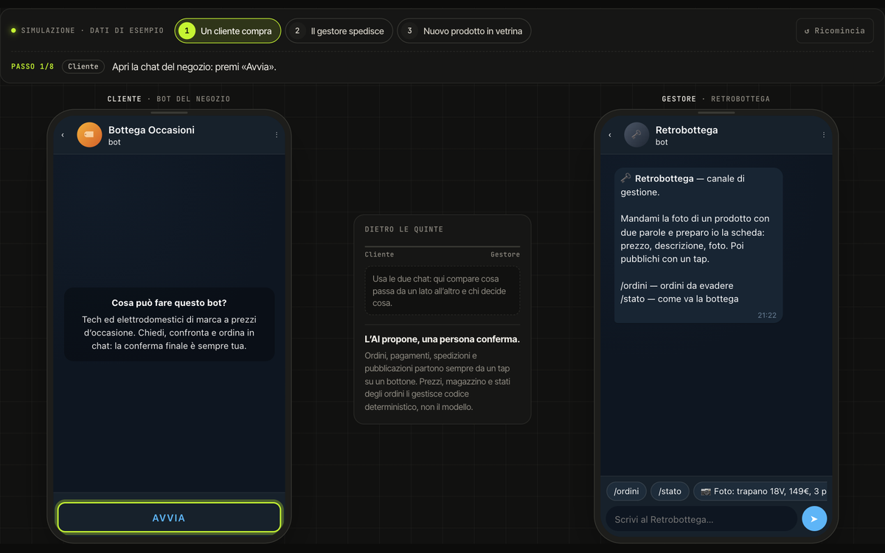

# E-commerce su Telegram

> Un negozio che vive in chat: il cliente compra parlando con un bot, il titolare gestisce tutto da un secondo bot. L’AI propone, le persone confermano.

`03` · **Progetto per un negozio di tecnologia** · 2026 · Progettazione e sviluppo completo

[**▶ Prova la demo**](https://portfolio.lele-tradevalue.com/progetti/ecommerce-assistente-ai/#demo) · [Caso studio completo](https://portfolio.lele-tradevalue.com/progetti/ecommerce-assistente-ai/) · [English version](https://portfolio.lele-tradevalue.com/en/progetti/ecommerce-assistente-ai/)

## Il problema

Un negozio di elettronica ed elettrodomestici in offerta vende soprattutto a chi gli scrive. Ogni messaggio — c’è ancora? quanto costa la spedizione? è partito il mio ordine? — porta via tempo, e caricare un prodotto nuovo sul sito è una piccola fatica quotidiana.

## Cosa ho costruito

Ho costruito due bot che lavorano in coppia. Il primo è il commesso: capisce richieste scritte, vocali e foto, propone due o tre prodotti, gestisce carrello, consegna, pagamento e assistenza. Il secondo è il retrobottega del titolare: riceve gli ordini in tempo reale, li evade con un tocco e trasforma una foto e due parole in una scheda prodotto pronta da pubblicare. Dietro ci sono una web app con catalogo e aste e i pagamenti Stripe.

## Come funziona

1. **Il cliente chiede** — «Cerco un condizionatore sotto i 350 euro»: il bot fa al massimo una domanda e propone le offerte giuste.
2. **Si conferma con un tocco** — Ordini, offerte d’asta e annullamenti passano sempre da un bottone: niente parte senza un sì esplicito.
3. **Pagamento sicuro** — Si paga su Stripe; appena il pagamento è registrato, cliente e titolare ricevono la conferma in chat.
4. **Il titolare evade** — Dal retrobottega vede cosa spedire, segna l’ordine come spedito e il cliente viene avvisato subito.
5. **Vetrina in un minuto** — Una foto con «trapano 18V, 149 €, 3 pezzi» diventa una scheda completa, che si pubblica con un tocco.

## Perché funziona

- **L’AI propone, le persone confermano.** Ogni azione irreversibile richiede un tocco umano su un bottone.
- **Prezzi e stock fuori dal modello.** Importi, disponibilità e ordini sono calcolati dal codice, mai generati.
- **Due ruoli, un solo canale.** Il cliente non scarica nessuna app e il titolare non apre nessun gestionale.
- **Aste che non si truccano.** Offerte confermate, avvisi a chi viene superato e chiusura estesa negli ultimi minuti.

## In numeri

| | |
|---:|---|
| **2** | bot, un solo backend |
| **3** | modi di consegna |
| **1** | tocco per pubblicare un prodotto |
| **0** | prezzi generati dall’AI |

## Stack

`Python` `FastAPI` `Telegram Bot API` `Claude` `SQLite` `Stripe` `React`

## Cosa resta privato

Nome del negozio, clienti e catalogo reali sono riservati: la simulazione usa un negozio inventato e dati di esempio. Questo repository contiene solo la presentazione del progetto: niente codice sorgente, cronologia o configurazioni.

<b>In English</b>

**Telegram commerce** — A shop that lives in chat: customers buy by talking to a bot, the owner runs everything from a second bot. The AI suggests, people confirm.

I built two bots that work as a pair. The first is the shop assistant: it understands text, voice notes and photos, suggests two or three products, and handles cart, delivery, payment and after-sales. The second is the owner’s back office: it receives orders in real time, fulfils them with a tap and turns a photo and a few words into a product listing ready to publish. Behind them sit a web app with catalogue and auctions, and Stripe payments.

- **AI suggests, people confirm.** Every irreversible action needs a human tap on a button.
- **Prices and stock outside the model.** Amounts, availability and orders are computed by code, never generated.
- **Two roles, one channel.** The customer installs nothing and the owner opens no back-office software.
- **Auctions that play fair.** Confirmed bids, alerts when you are outbid and extended closing in the final minutes.

[Read the full case study and try the demo →](https://portfolio.lele-tradevalue.com/en/progetti/ecommerce-assistente-ai/)

---

Emanuele Montalto · [portfolio](https://portfolio.lele-tradevalue.com) · [LinkedIn](https://www.linkedin.com/in/emanuele-montalto/) · [montalto36@gmail.com](mailto:montalto36@gmail.com)
